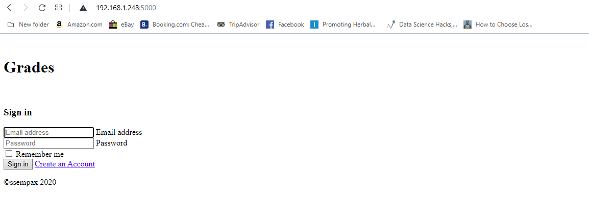
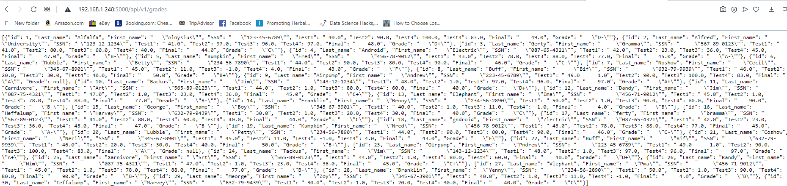
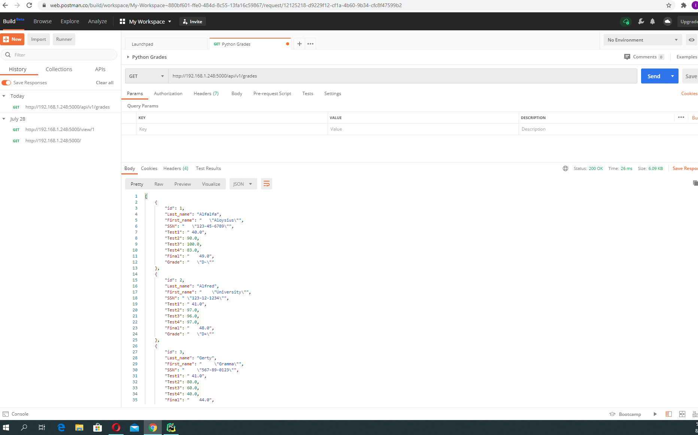

# Web Individual Final Project

## Project Description 
This project is a homework assignment to teach how to get Pycharm setup with Docker, Flask, MySQL, and Postman

### Login Screenshots

### GET Screenshots 

### Deleted Screenshots

### Put Screenshots

### PostmanScreenshots
